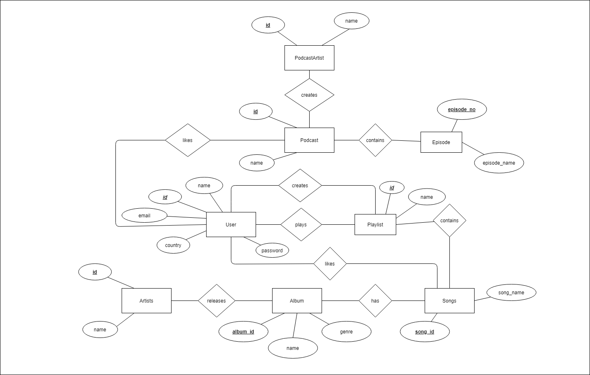
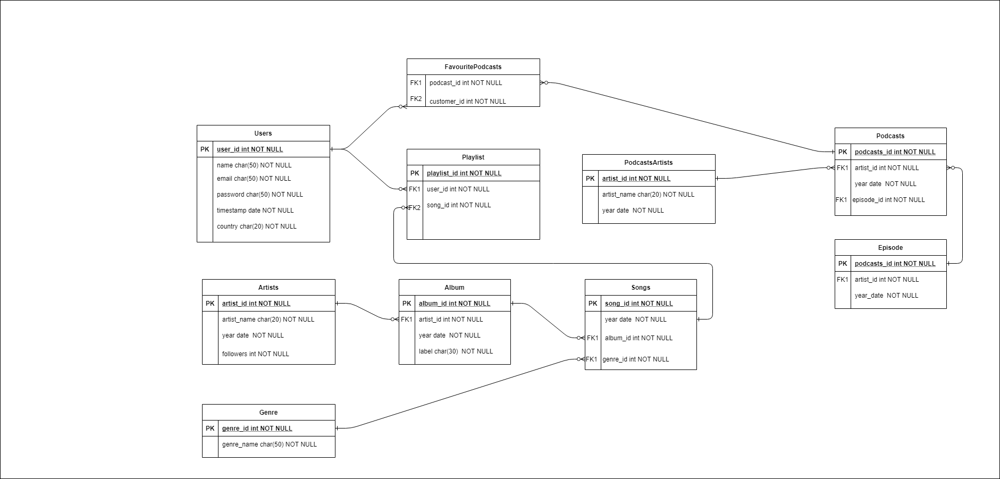

# PL305 Project: Music streaming platform

Database management for a platform to stream music and podcasts using [MySQL](https://www.mysql.com/) and [Vue.js 3](https://v3.vuejs.org/).
The user can register. The user can like songs, create playlists, follow their favourite podcasts.

##### Entities

- User
- Artists
- Songs
- Albums
- Playlists
- Podcasts
- Podcasters
- Episodes
- Favourites

### Getting Started

- [Yarn](https://classic.yarnpkg.com/lang/en/)
- [Node.js](https://nodejs.org/en/)
- [MySQL Workbench](https://dev.mysql.com/downloads/workbench//)
- after starting the the backend and frontend server
  visit http://localhost:3000

### ERD

### UML

### Snapshots
